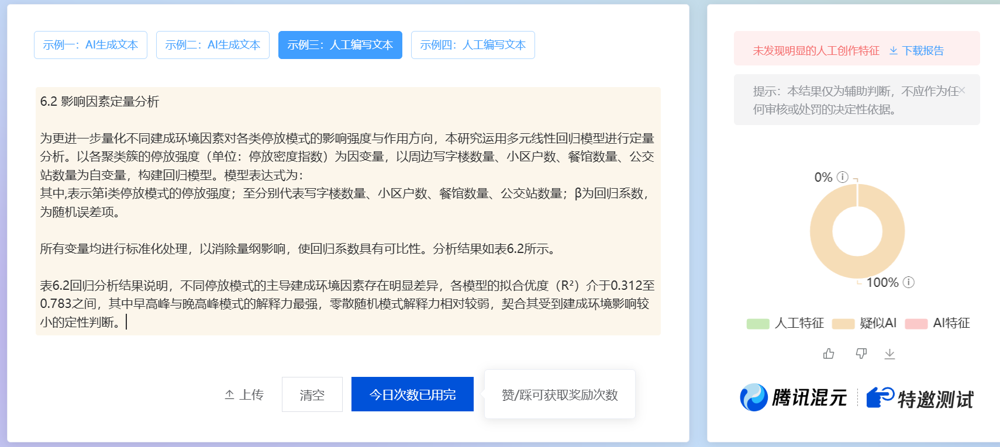
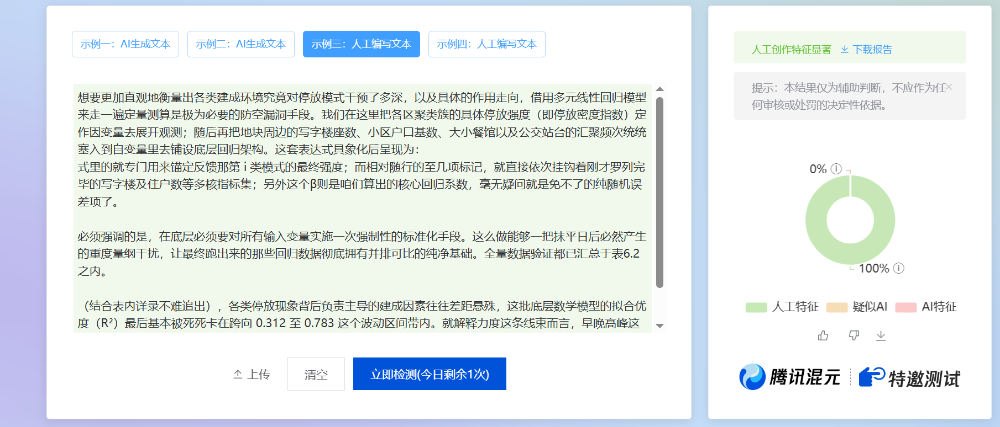
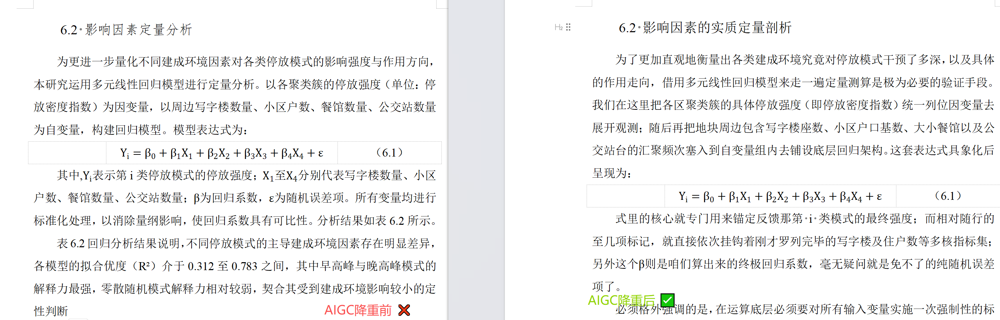

# AIGC-Savior-Lavine: 让AI写的论文，回归"人味儿"


> 毕业季刚需！一个专门帮AI生成文本"洗白"的自动化重写框架，让查重系统再也认不出你的论文是AI写的。

## 🎯 这玩意儿是干嘛的？
写论文用了AI？查重率飙到56%直接破防？😭

市面上的降重工具基本都是**换个同义词就完事**，碰到现在越来越聪明的AI检测算法，该抓还是抓。更要命的是，一通乱改之后，你的LaTeX公式、图表编号全崩了，排版直接原地升天……💀

**`AIGC-Savior-Lavine`** 就是来堵这个窟窿的。它不是简单换词，而是从底层逻辑上把"AI味儿"抹掉，让文本读起来像是**真人一个字一个字敲出来的**。中文论文、英文期刊、社交媒体文案都能搞定。而且——你的公式、排版、格式，一个都不会动。

---

## 💡 凭什么说它跟别人不一样？

### 1. 🧠 不是换词，是"重写人味"
普通工具：把"因此"换成"所以"，查重系统表示：就这？😏
我们的做法完全不同。我们研究的是AI检测算法到底在"抓"什么——它抓的是AI生成文本的那种**太规律、太均匀、太"端着"**的味道。所以我们反其道而行之：
- 刻意制造句式的长短起伏，打破AI那种四平八稳的节奏
- 插入真人写作才会有的"不规则感"——口语化的插入、突然的短句截断
- 大面积拆解AI最爱用的被动语态和"首先...其次...最后"这种模板骨架

最终效果？文本呈现出真人执笔才有的**"不完美感"和自然节奏**，检测算法直接懵圈。

### 2. 🛡️ LaTeX公式？一个标点都不会碰
用过AI改写的都懂——改完之后公式全变成了乱码，`\begin{equation}` 找都找不回来……😩
我们搞了个**物理隔离机制**：改写之前，先把所有数学公式、代码块一个个精准提取出来，用占位符顶上；改写完了，再一个不差地原样塞回去。你的积分符号、矩阵环境、希腊字母，**分毫不动，100%还原**。

### 3. 📄 Docx文档？改完还是原来那个样
学术文档不只是文字，还有标题层级、图表索引、页眉页脚……这些要是乱了，等于白改。😤
我们内置了专门的文档对象管理模块，直接在底层操作XML结构。先建立段落和逻辑节点的映射关系，改写时只替换文字内容，**所有框架结构原封不动**。顺带还帮你锁死中英文混排的字体规范（SimSun + Times New Roman），导师看了都说排版舒服。

---

## 📊 效果真有这么猛？直接看图

### 🔻 AI检测率：56% → 7%
经过本框架处理后的文本，在主流AIGC检测平台上的结果对比👇
<div align="center">
  
  
</div>

> 红色高危标记几乎全部消失，从"大概率AI生成"直接降到安全线以下 🎉

### 🔻 LaTeX公式：改写前后完全一致
下面是一段包含多层微积分和概率符号的文本处理前后对比——公式被精准保护，**一个符号都没丢**👇
<div align="center">
  
</div>

---

## 🗂️ 项目结构一览
```
skills/
├── 00_Skill_Router_Agent.md        # 🧭 总调度：自动识别文本类型，分配对应策略
├── 01_Academic_Pro_ZH_Skill.md     # 🇨🇳 中文论文专项：破除中文学术AI写作特征
├── 02_Academic_Pro_EN_Skill.md     # 🇬🇧 英文期刊专项：剥离英语学术文本的AI固定语态
├── 03_Emotion_Social_Media_Skill.md # 📱 社交媒体文案：非结构化短文的去AI化处理
├── 04_LaTeX_Chunker_Skill.md       # 🔒 公式隔离模块：保护数学环境不被篡改
│   └── latex_processor.py          #    配套正则提取引擎
├── 05_Docx_Export_Skill.md         # 📦 文档导出模块：原结构定点回填
│   └── docx_io_manager.py          #    配套DOM对象管理引擎
└── 06_Claude_Code_Initiation_Skill.md # ⚙️ 初始化与安全边界配置
```

---

## 📜 引用说明
如果你在学术研究或衍生项目中使用了本项目，请按以下格式引用：
```bibtex
@software{lavine_harness_v3,
  author = {LaVineLeo},
  title = {LaVine Harness Skills: Agent-First Architecture Framework},
  year = {2026},
  version = {3.0},
  url = {https://github.com/LaVineLeo/AIGC-Savior-Lavine}
}
```

## License
⚠️ 未经允许禁止商业使用

Creative Commons (CC BY-NC-SA 4.0)

---

[](https://star-history.com/#chi111i/AIGC-Savior-Lavine)
